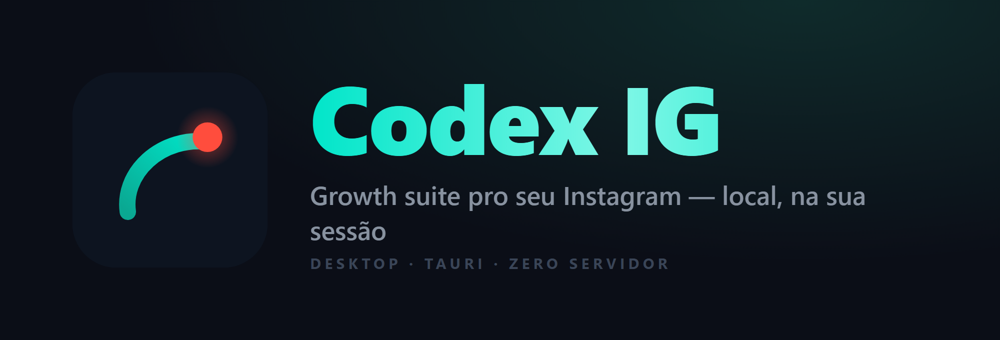
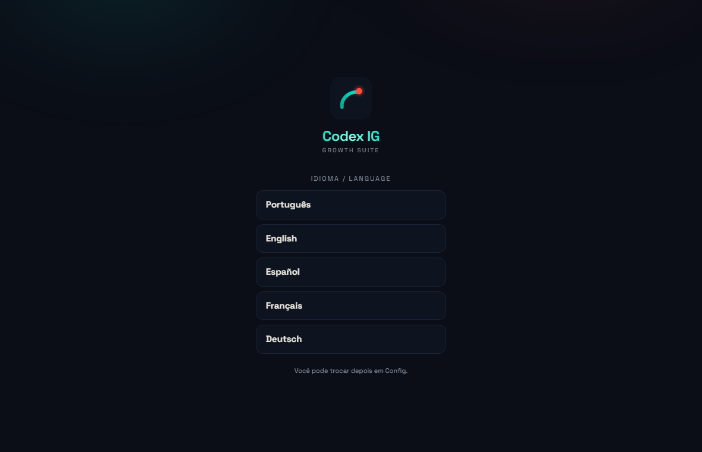
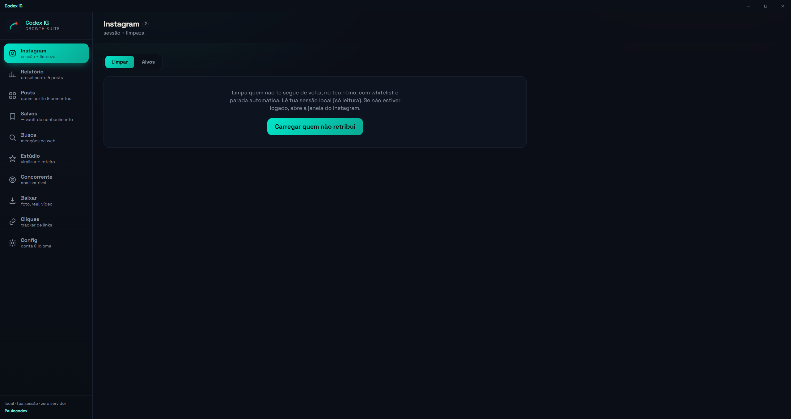
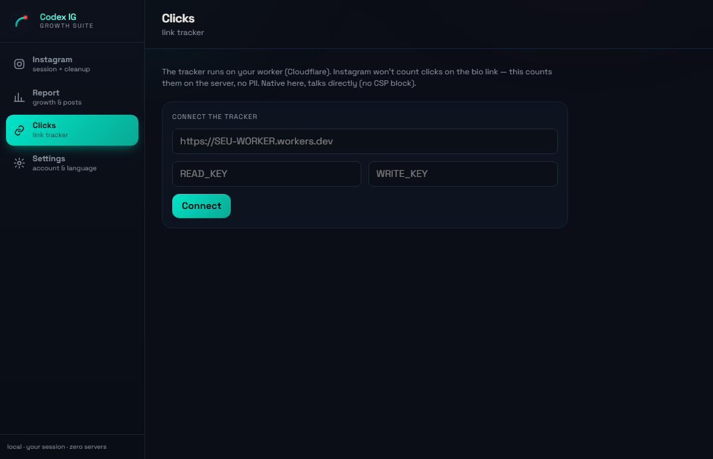

# Codex IG

**Growth suite pro seu Instagram — roda na sua própria sessão, 100% local, sem bot que loga por você.**

---

## 🥷 O mascote

Um **navegador-Codex dedicado**: abre o instagram.com onde **você loga normal** (a sua sessão), e o app lê essa sessão pra entregar, em telas nativas, tudo que a suíte faz. Não é bot de login (bane), não passa por loja (reprova app que automatiza Instagram) → **download direto e grátis**.

Leitura = risco baixo; unfollow = **você define o ritmo**, com medidor de risco e parada automática no bloqueio. Nada de curtir/comentar em massa em terceiros (é o que bane). **Você fica no controle.**

 

## 📸 Telas

| Escolha de idioma (1ª abertura) | Instagram — Limpar & Alvos | Cliques (tracker) |
|:---:|:---:|:---:|
|  |  |  |

## ✨ O que faz

- **Instagram** — *Limpar* (deixar de seguir quem não retribui, ritmado, com whitelist e parada automática) + *Alvos* (seguidores de concorrentes = seu público).
- **Relatório** — seguindo/seguidores/não-retribuem/mútuos/fãs, engajamento e top posts, **crescimento de seguidores no tempo** (SQLite local) e quem deixou de te seguir.
- **Cliques** — tracker de cliques no link da bio (worker Cloudflare próprio), sem PII.
- **Config** — conta, whitelist, export CSV, **5 idiomas** (PT/EN/ES/FR/DE) e privacidade.
- **Tudo local** — cookies lidos em runtime, **nunca gravados**, sem servidor de terceiro. Auto-update assinado.

## 📥 Download

Baixe o instalador mais novo em **[Releases](https://github.com/Paulothedeveloper/codex-ig-desktop/releases/latest)** → `Codex IG_x.y.z_x64-setup.exe`.

Instala **por usuário, sem admin**. Não é assinado com cert pago → o Windows pode mostrar "editor desconhecido" (Mais informações → Executar assim mesmo). Auto-update assinado a partir da v0.2.0.

## 🔒 Privacidade

Tudo **local**. Os cookies do Instagram são lidos em tempo de execução e **nunca gravados** por nós. Dados no seu aparelho (SQLite). As chaves do tracker ficam no app. Sem servidor de terceiro, sem PII.

## ⚠️ Aviso

Ferramenta de automação do **seu próprio** Instagram. Pode contrariar os Termos do Instagram e há risco de bloqueio temporário — **uso por sua conta e risco**, sem garantia. Ver [`DISCLAIMER.md`](DISCLAIMER.md).

## 🛠 Stack

Tauri 2 · Rust (`reqwest`, `sqlx` via `tauri-plugin-sql`) · React 19 + Vite + TypeScript + Tailwind v4 · identidade **Codex Arena**, fonte Space Grotesk self-hosted. Rodar em dev: `cd app && npm install && npm run tauri dev`.

---

## In English

Desktop **growth / report / link-click** app for **your own** Instagram — runs on **your real session**, 100% local, no login-bot, no store, **free**. Native screens for cleanup (unfollow non-followers at your pace, whitelist + auto-stop), competitor-follower targeting, growth report (followers over time via local SQLite), and a bio-link click tracker on your own Cloudflare worker. Instagram cookies are read at runtime, **never stored**; no third-party server, no PII. 5 languages, signed auto-update. **Use at your own risk** (may conflict with Instagram's Terms — see [`DISCLAIMER.md`](DISCLAIMER.md)). Download: **[Releases](https://github.com/Paulothedeveloper/codex-ig-desktop/releases/latest)**.

---

## 👤 Sobre o desenvolvedor

**Paulo** é desenvolvedor indie e produtor de vídeo brasileiro (estúdio [Paulocodex](https://paulocodex.com)). O Codex IG começou como um kit no console do navegador pra organizar o próprio Instagram e virou um app desktop nativo, aberto e local-first — roda na sessão real do usuário, sem servidor. Desenvolve de forma aberta e ouve quem usa.

 

## 📜 Licença

[MIT](LICENSE) — © 2026 Paulo Batista (Paulocodex). Software "as is", sem garantia.

---

📧 [contato@paulocodex.com](mailto:contato@paulocodex.com) · 📸 [Instagram](https://instagram.com/paulodev.codex) · 💼 [LinkedIn](https://www.linkedin.com/in/paulo-adriel/) · 🌐 [paulocodex.com](https://paulocodex.com) · 🐙 [github.com/Paulothedeveloper](https://github.com/Paulothedeveloper)

